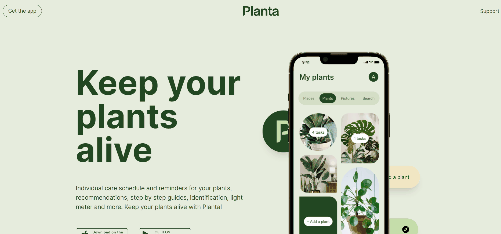

# Planta App Landing Page

Landing page pra um aplicativo fictício criada com vanilla CSS e Javascript.

[Versão live](https://denisesantosdev.github.io/planta-app-landing-page/)

Projeto mais simples pra começar o ano. Fiz esse projeto depois de ver a primeira parte [desse curso](https://scrimba.com/learn/spacetravel "Scrimba | Build a space travel website"). Pra fazer as animações usei a API Intersection Observer do próprio javascript.

